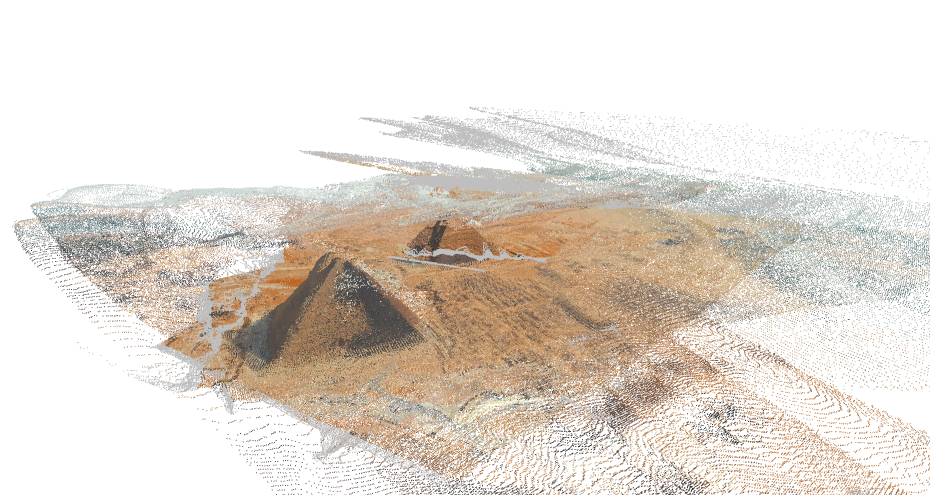

# MsnBaker-VGGT

<div style="display: flex; gap: 10px;">
  
  
</div>

## 中文版
[🌐 中文版](README.md)

## 1. Abstract
I modify the preprocessing of FastVGGT's model to support different size input images.

## 2. Quick Start
### (1) Download/Clone Repository
First, clone the repository:
```bash
git clone https://github.com/MsnBaker/MsnBaker-VGGT.git
```

### (2) Build Environment and Install Dependencies
```bash
conda create -n vggt python=3.10
conda activate vggt
cd MsnBaker-VGGT
pip install -r requirements.txt
``` 
### (3) Download Model Weights
[click me to download](https://huggingface.co/facebook/VGGT-1B/blob/main/model.pt)

Then, put the model weights file in the project root directory
and name it model.pt
Remember the path of the model weights file. And then remember to change the path of the model weights file in the code.

### (4) Run the code
First, enter the project file directory, and run
```bash
python demo_without_mask.py --data_path /PATH_TO_YOUR/images --ckpt_path /PATH_TO_YOUR/model.pt
```
Remember to replace "PATH_TO_YOUR/model.pt" with the path of your saved model weights.
And replace "/PATH_TO_YOUR/images" with the path of your input images.

## 3. Acknowledgment
Thanks for their great code:
[VGGT](https://github.com/facebookresearch/vggt)  
[FastVGGT](https://github.com/mystorm16/FastVGGT)